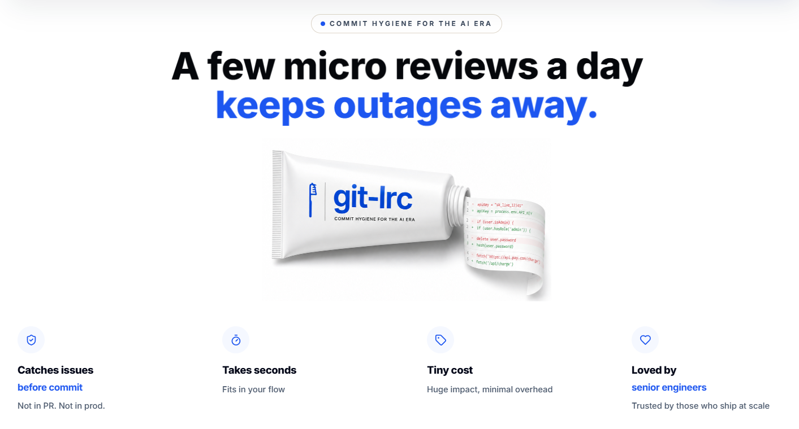
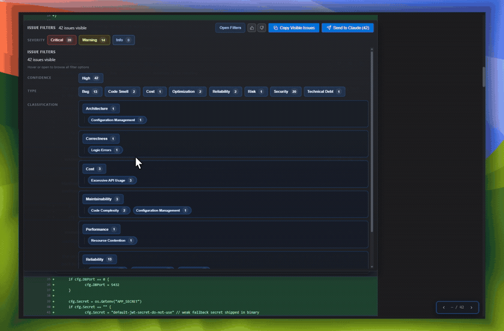
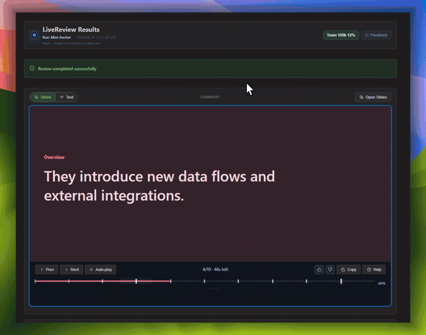

<div align="left">

| [🇩🇰 Dansk](readme/README.da.md) | [🇪🇸 Español](readme/README.es.md) | [🇮🇷 Farsi](readme/README.fa.md) | [🇫🇮 Suomi](readme/README.fi.md) | [🇯🇵 日本語](readme/README.ja.md) | [🇳🇴 Norsk](readme/README.nn.md) | [🇵🇹 Português](readme/README.pt.md) | [🇷🇺 Русский](readme/README.ru.md) | [🇦🇱 Shqip](readme/README.sq.md) | [🇨🇳 中文](readme/README.zh.md) | [🇮🇳 हिन्दी](readme/README.hi.md) | 

<br />
<br />


<br />
<h1>git-lrc</h1>

<h2>Free, Micro AI Code Reviews That Run on Commit</h2>


<br />
<br />


<a href="https://www.producthunt.com/products/git-lrc?embed=true&amp;utm_source=badge-top-post-badge&amp;utm_medium=badge&amp;utm_campaign=badge-git-lrc" target="_blank" rel="noopener noreferrer"></a>
&nbsp;

<br />
<a href="https://discord.gg/sGdnKwB3qq" target="_blank">
  
</a> <a href="https://goreportcard.com/report/github.com/HexmosTech/git-lrc" target="_blank" rel="noopener noreferrer"></a>&nbsp;<a href="https://github.com/HexmosTech/git-lrc/actions/workflows/gitleaks.yml" target="_blank" rel="noopener noreferrer"></a>&nbsp;<a href="https://github.com/HexmosTech/git-lrc/actions/workflows/osv-scanner.yml" target="_blank" rel="noopener noreferrer"></a>&nbsp;<a href="https://github.com/HexmosTech/git-lrc/actions/workflows/govulncheck.yml" target="_blank" rel="noopener noreferrer"></a>&nbsp;<a href="https://github.com/HexmosTech/git-lrc/actions/workflows/semgrep.yml" target="_blank" rel="noopener noreferrer"></a>&nbsp;
</div>

<br />
<br />



---

GenAI today is a **race car without brakes**. It accelerates fast -- you describe something, and large blocks of code appear instantly. But AI agents _silently break things_: they remove logic, relax constraints, introduce expensive cloud calls, leak credentials, and change behavior -- without telling you. You often find out in production.

**`git-lrc` is your braking system.** It hooks into `git commit` and runs an AI review on every diff _before_ it lands. 60-second setup. Completely free.

In short, git-lrc helps **Prevent Outages, Breaches, and Technical Debt Before They Happen**

**At a glance:** [10 risk categories](#what-git-lrc-checks-for) &middot; [100+ failure patterns tracked](#what-git-lrc-checks-for) &middot; every commit scanned automatically.

```bash
# Try it now (Linux/macOS)
curl -L https://hexmos.com/ipm-install | bash && ipm i HexmosTech/git-lrc
```

Windows, alternative installs, and full setup walkthrough: see [Get Started](#get-started).

## Issue Navigator

A wall of inline comments is hard to triage. The Issue Navigator turns every review into a structured, filterable view across [10 risk categories and 100+ patterns](#what-git-lrc-checks-for) — so you can see exactly what's wrong, ranked by how much it can hurt you.



- **Filter by severity** — Critical, Warning, Info — fix what matters first instead of scrolling through everything.
- **Drill into categories and subcategories** — Security → Secrets Management, Reliability → Error Handling, and 100+ more, each with a live count of how many issues were found.
- **Slice by type and area** — Bug, Code Smell, Reliability, Security — to see exactly where risk is concentrated in a diff.
- **Send straight to your AI agent** — copy the visible issues or "Send to Claude" and feed them back into the fix loop without retyping anything.
- **Feedback loop built in** — thumbs up/down on each finding tunes future reviews, so signal-to-noise improves the more your team uses it.

## Summary Deck

Every completed review also generates a short slide deck — a 60-second summary of what changed, why, and what risks were flagged, without anyone having to write it.



- **What was implemented, in plain English** — a short narrative of the change, not just a diff.
- **Risks called out up front** — security, cost, and reliability issues get their own highlighted slides, in red when they matter.
- **Technical highlights, isolated** — new config, new endpoints, new data flows — the things a reviewer (or future-you) actually needs to know about.
- **Pairs with [Git Log Tracking](#git-log-tracking)** — between the iteration/coverage history in your git log and the summary deck for each review, your team gets institutional memory of every change without anyone maintaining a changelog.

For onboarding new engineers, post-incident reviews, or just remembering why a change was made six months ago, this is the fastest way to get oriented — without re-reading the diff.

## See It In Action

> See git-lrc catch serious security issues such as leaked credentials, expensive cloud
> operations, and sensitive material in log statements

https://github.com/user-attachments/assets/cc4aa598-a7e3-4a1d-998c-9f2ba4b4c66e

## Why

- **AI agents silently break things.** Code removed. Logic changed. Edge cases gone. You won't notice until production.
- **Catch it before it ships.** AI-powered inline comments show you _exactly_ what changed and what looks wrong.
- **Build a habit, ship better code.** Regular review → fewer bugs → more robust code → better results for your team.
- **Why not wait for a PR?** By PR time, the faulty code is already committed, pushed, and visible. That is too late for issues you could have fixed yourself while the change was still fresh, without pulling team attention into avoidable cleanup.
- **Why not rely on IDE extensions?** Extensions are convenience, not a universal trigger. An engineer may choose to run them or not, and teams do not share one editor.
- **Why commit?** Commit is the sweet spot: early enough to catch problems before they enter permanent git history, but not so early that review depends on individual discretion or special tooling.
- **Git is the common denominator.** You can't force every engineer onto one IDE or one AI assistant -- but everyone commits. `git-lrc` plugs into the one workflow step every team already shares.
- **Built on habit, not hype.** No new dashboard to check, no new ritual to adopt. It rides the commit you were already going to make.

## Get Started

### Install

#### Via IPM (Recommended):
```bash
# Linux/macOS
curl -L https://hexmos.com/ipm-install | bash && ipm i HexmosTech/git-lrc

# Windows
iwr https://hexmos.com/ipm-install-ps | iex; ipm i HexmosTech/git-lrc
```

#### Alternative (direct install):

**Linux / macOS:**

```bash
curl -fsSL https://hexmos.com/lrc-install.sh | bash
```

**Windows (PowerShell):**

```powershell
iwr -useb https://hexmos.com/lrc-install.ps1 | iex
```

<details>
<summary><strong>GitHub Codespaces</strong></summary>

```bash
curl -fsSL https://git.new/lrc-install | bash
```

</details>

Binary installed. Hooks set up globally. Done.

### Also Included: claude-lrc for Claude Code

Installing `git-lrc` also gives you **[claude-lrc](https://github.com/HexmosTech/claude-lrc)** -- the same review, vouch, and skip workflow, available as slash commands right inside Claude Code. No separate install, no leaving the chat.

| What you want            | How                  |
| ------------------------- | -------------------- |
| Natural language          | `review with lrc`    |
| Slash command              | `/lrc:review`         |
| Quality vouch              | `/lrc:vouch`          |
| Intentional bypass          | `/lrc:skip`           |

Use **`git-lrc`** when you want editor-independent, commit-time enforcement across repos and tools. Use **`claude-lrc`** when you want natural-language and slash-command control directly inside Claude Code.

### Setup

```bash
git lrc setup
```

Here's a quick video of how setup works:

https://github.com/user-attachments/assets/392a4605-6e45-42ad-b2d9-6435312444b5

Two steps, both open in your browser:

1. **LiveReview API key** — sign in with Hexmos
2. **Free Gemini API key** — grab one from Google AI Studio

**~1 minute. One-time setup, machine-wide.** After this, _every git repo_ on your machine triggers review on commit. No per-repo config needed.

## Pricing

Predictable, LOC-based. 30k LOC free every month. Premium starts at $32 for 100k LOC. No headcount based pricing, scales with workload.

| Tier                  | What you get                                                  | Notes                                                          |
| --------------------- | -------------------------------------------------------------- | ----------------------------------------------------------------- |
| **1. Free Individual** | Install `git-lrc` and start with 30k LOC per month             | Bring your own AI keys. Keep `git-lrc` and the VS Code extension.   |
| **2. Premium**          | Upgrade when 30k LOC is not enough                              | Starts at $32 for 100k LOC. Scales by workload, not by seat.        |
| **3. Enterprise**       | Move further for privacy and deployment control                | Self-hosting, SSO, custom domains, and tighter data control.        |

No credit card required for the free tier. See the [full pricing page](https://hexmos.com/livereview/git-lrc/pricing/) for details.

## How It Works

### Option A: Review on commit (automatic)

```bash
git add .
git commit -m "add payment validation"
# review launches automatically before the commit goes through
```

### Option B: Review before commit (manual)

```bash
git add .
git lrc review          # run AI review first
# or: git lrc review --vouch   # vouch personally, skip AI
# or: git lrc review --skip    # skip review entirely
git commit -m "add payment validation"
```

Either way, a web UI opens in your browser.

https://github.com/user-attachments/assets/ae063e39-379f-4815-9954-f0e2ab5b9cde

### The Review UI

- **GitHub-style diff** — color-coded additions/deletions
- **Inline AI comments** — at the exact lines that matter, with severity badges
- **Review summary** — high-level overview of what the AI found
- **Staged file list** — see all staged files at a glance, jump between them
- **Diff summary** — lines added/removed per file for a quick sense of change scope
- **Copy issues** — one click to copy all AI-flagged issues, ready to paste back into your AI agent
- **Cycle through issues** — navigate between comments one by one without scrolling
- **Event log** — track review events, iterations, and status changes in one place

https://github.com/user-attachments/assets/b579d7c6-bdf6-458b-b446-006ca41fe47d

### The Decision

| Action               | What happens                           |
| -------------------- | -------------------------------------- |
| **Commit**           | Accept and commit the reviewed changes |
| **Commit & Push**    | Commit and push to remote in one step  |
| **Skip**             | Abort the commit — go fix issues first |

```
📎 Screenshot: Pre-commit bar showing Commit / Commit & Push / Skip buttons
```

## The Review Cycle

Typical workflow with AI-generated code:

1. **Generate code** with your AI agent
2. **`git add .` → `git lrc review`** — AI flags issues
3. **Copy issues, feed them back** to your agent to fix
4. **`git add .` → `git lrc review`** — AI reviews again
5. Repeat until satisfied
6. **`git lrc review --vouch`** → **`git commit`** — you vouch and commit

Each `git lrc review` is an **iteration**. The tool tracks how many iterations you did and what percentage of the diff was AI-reviewed (**coverage**).

### Vouch

Once you've iterated enough and you're satisfied with the code:

```bash
git lrc review --vouch
```

This says: _"I've reviewed this — through AI iterations or personally — and I take responsibility."_ No AI review runs, but coverage stats from prior iterations are recorded.

### Skip

Just want to commit without review or responsibility attestation?

```bash
git lrc review --skip
```

No AI review. No personal attestation. The git log will record `skipped`.

## Git Log Tracking

Every commit gets a **review status line** appended to its git log message:

```
LiveReview Pre-Commit Check: ran (iter:3, coverage:85%)
```

```
LiveReview Pre-Commit Check: vouched (iter:2, coverage:50%)
```

```
LiveReview Pre-Commit Check: skipped
```

- **`iter`** — number of review cycles before committing. `iter:3` = three rounds of review → fix → review.
- **`coverage`** — percentage of the final diff already AI-reviewed in prior iterations. `coverage:85%` = only 15% of the code is unreviewed.

Your team sees _exactly_ which commits were reviewed, vouched, or skipped — right in `git log`.


## Bring Your Own AI Connector (BYOK)

In addition to the default Gemini setup, you can bring your own API keys for:

- OpenAI
- Claude
- DeepSeek
- OpenRouter
- [Atlas Cloud](https://www.atlascloud.ai?utm_source=git-lrc)

Use:

```bash
lrc ui
```

From the UI, you can:

- Re-authenticate your account
- Add or update AI connectors
- Reorder connectors to set priority

By default, the **first connector in the list** is used for reviews.


### Compatible API Support

We also support:
- Anthropic Compatible API

To configure:
- Select the option `Anthropic Compatible API` connector from the UI.
- Set the base URL for the API connector by selecting from the dropdown (e.g., [`gw.claudeapi.com`](https://claudeapi.com?utm_source=git-lrc)) or entering a custom URL.
- Enter your API key.
- Select the Claude model to use for reviews.

> Setup guide: [Using ClaudeAPI with git-lrc](https://claudeapi.com/en/blog/tools/git-lrc-claudeapi-setup-guide/?utm_source=git-lrc)

### Atlas Cloud Support
We also support:


[Atlas Cloud](https://www.atlascloud.ai?utm_source=git-lrc) 

To configure:
- Select the option `Atlas Cloud` connector from the UI.
- Enter your Atlas Cloud API key.
- Select the model to use for reviews (e.g., `deepseek-ai/deepseek-v4-flash`). 

## Repository Rules — Teaching the Reviewer About Your Repository

A good reviewer doesn't just know your language and framework — it knows
*your repository*: which patterns your team prefers, which dependencies are
off-limits, and which shortcuts are fine here but wouldn't be elsewhere. Most
of that knowledge never makes it into docs, which is why AI review can feel
like feedback from a new hire.

git-lrc lets you write that knowledge down once, in a `.lrc/` directory at
the root of your repo, version-controlled like everything else:

```bash
lrc config init
```

```
.lrc/
├── README.md            # explains this setup
├── ignore                # files/paths the reviewer should never see
└── rules/
    ├── INSTRUCTIONS.md   # read first — your most important guidance
    ├── design.md
    ├── security.md
    └── style.md          # add as many *.md files as you need
```

- **`rules/*.md`** — short notes on how your team works, e.g. *"Prefer direct
  SQL over ORM abstractions"* or *"Avoid new infrastructure dependencies."*
  `INSTRUCTIONS.md` is read first; every other file follows in order. All of
  it is combined into one set of instructions sent to the reviewer.
- **`ignore`** — gitignore-style patterns for files the reviewer should skip
  entirely (generated code, vendored files, etc.). Ignored files aren't sent
  to the AI and don't count toward billable lines.
- **`policy/`** — *(TODO, not yet enforced)* machine-readable settings, such
  as which tools the reviewer is allowed to use.

### Keep it short

The `rules/` bundle is capped at 3000 characters. That's on purpose — a
twenty-page style guide gets skimmed, by humans and AI alike. A handful of
sentences that repeatedly change a review's outcome are worth far more than a
full manual:

- "Reliability matters more than latency."
- "Prefer explicit implementations over abstraction layers."
- "Avoid new infrastructure dependencies."
- "Direct SQL is preferred over ORM abstractions."

### Nothing hidden

```bash
lrc config check    # validate rules, ignore patterns, and bundle size — offline
lrc config preview  # show the exact instructions that will be sent to the reviewer
```

If it's sent to the model, you can see it first.

## Security You Can Trust

- Security is treated as a core product requirement in git-lrc.
- We document reporting channels, response commitments, and operational safeguards clearly.
- Automated security checks and SBOM workflows support transparent verification.
- For complete details, see [SECURITY.md](SECURITY.md).

## What git-lrc Checks For

Every review is checked against **10 risk categories** and **100+ specific failure patterns**, grouped into three pillars: what takes down production, what ends up in a disclosure letter, and what slows every future release. Expand any pillar, then any category, to see the exact patterns and why each one matters.

<details>
<summary><strong>Outages</strong> — what takes down production, and your on-call rotation (4 categories, 40 patterns)</summary>

<details>
<summary><strong>Reliability</strong></summary>

- **Error Handling** — Unhandled errors crash services mid-request, leaving customers staring at broken pages during peak traffic.
- **Fault Tolerance** — One dependency hiccup cascades into a full outage instead of degrading gracefully.
- **Retry Logic** — Missing retries turn brief network blips into failed payments, lost orders, and support tickets.
- **Timeout Management** — Requests hang forever, exhausting connections until the whole service grinds to a halt.
- **Resilience Patterns** — No circuit breakers means one slow service drags down everything connected to it.
- **Availability Risks** — Single points of failure turn a routine deploy into a multi-hour outage.
- **Data Integrity** — Corrupted or inconsistent records silently poison reports, billing, and downstream decisions.
- **Race Conditions** — Two requests collide and overwrite each other's work — intermittently, unreproducibly, in production.
- **Resource Cleanup** — Leaked connections and file handles pile up until the server falls over at 2am.
- **Failure Recovery** — No rollback path means a bad deploy stays live until someone manually fixes it.

</details>

<details>
<summary><strong>Correctness</strong></summary>

- **Logic Errors** — Wrong calculations ship to production and quietly produce incorrect invoices, prices, or reports.
- **Edge Cases** — The 1% scenario nobody tested is the one your biggest customer hits first.
- **Data Validation** — Bad input slips through and corrupts records that are expensive to clean up later.
- **State Management** — Stale or out-of-sync state shows users the wrong balance, status, or inventory count.
- **Concurrency Bugs** — Parallel operations step on each other, causing duplicate charges or lost updates.
- **Business Rule Violations** — A discount, limit, or policy nobody approved gets applied automatically, at scale.
- **Numerical Accuracy** — Rounding and precision errors compound into real financial discrepancies over time.
- **Null Handling** — An unexpected null crashes the checkout flow at the worst possible moment.
- **Type Safety** — A type mismatch silently mangles data instead of failing loudly where it's cheap to fix.
- **API Contract Violations** — A backend change breaks every client that depends on the old response shape.

</details>

<details>
<summary><strong>Performance</strong></summary>

- **Database Efficiency** — An unindexed query that's fine today locks up the database the moment you scale.
- **Algorithmic Complexity** — Code that's fast with 100 records grinds to a crawl with 100,000.
- **Memory Usage** — Memory leaks force daily restarts — and eventually an outage when nobody's watching.
- **CPU Utilization** — A hot loop quietly burns CPU until autoscaling bills spike or pods get killed.
- **Network Efficiency** — Chatty calls multiply latency until a simple page takes seconds to load.
- **Caching** — Every request hits the database directly, so traffic spikes become outages.
- **Concurrency** — Without proper concurrency, your service serves one user at a time under load.
- **Resource Contention** — Threads fight over the same lock, and the whole app slows to match the slowest one.
- **Rendering Performance** — A janky UI makes users think the product is broken, even when it isn't.
- **Startup Performance** — Slow boot times mean slow deploys, slow rollbacks, and slow recovery from incidents.

</details>

<details>
<summary><strong>Scalability</strong></summary>

- **Horizontal Scaling** — The app can't run on more than one instance, so growth means a rewrite.
- **Vertical Scaling** — You're one viral spike away from maxing out the biggest server money can buy.
- **Distributed Systems** — Two services disagree about reality, and nobody notices until the numbers don't add up.
- **Load Balancing** — Traffic piles onto one node while others sit idle, until that one node falls over.
- **Capacity Planning** — Nobody knows the breaking point until customers find it for you, live.
- **Bottleneck Risks** — One slow component caps the throughput of the entire system, no matter what else you scale.
- **Concurrency Limits** — A hardcoded limit silently throttles your busiest customers during your biggest moments.
- **Service Growth Constraints** — What works for 10 teams collapses under coordination overhead at 50.
- **Database Scaling** — The database that powered your launch becomes the thing that takes you down at scale.
- **Queue Backpressure** — Unbounded queues hide a growing backlog until it surfaces as hours-long delays.

</details>

</details>

<details>
<summary><strong>Breaches</strong> — what ends up in a disclosure letter, and a board meeting (2 categories, 20 patterns)</summary>

<details>
<summary><strong>Security</strong></summary>

- **Authentication** — A weak login flow is an open door — and attackers check every door.
- **Authorization** — A missing permission check lets any logged-in user act as an admin.
- **Secrets Management** — A hardcoded API key in source control is a breach waiting for someone to find it.
- **Input Validation** — Unvalidated input is the first line in almost every successful attack.
- **Injection Vulnerabilities** — One unsanitized query away from an attacker reading your entire database.
- **Cryptography** — Weak or homemade encryption gives a false sense of security — and a real breach.
- **Dependency Vulnerabilities** — A known CVE in a dependency is a published instruction manual for attackers.
- **Data Exposure** — Sensitive fields leak into logs, responses, or error messages where they don't belong.
- **Session Management** — A session that never expires is a credential an attacker can use forever.
- **Security Logging & Auditing** — Without audit trails, you can't tell what happened, when, or who's responsible — during an incident or after.

</details>

<details>
<summary><strong>Compliance & Governance</strong></summary>

- **Privacy** — Mishandled personal data turns a code review comment into a regulatory investigation.
- **Regulatory Compliance** — A missed requirement in GDPR, HIPAA, or SOC 2 becomes a finding in your next audit.
- **Auditability** — When auditors ask "who changed this and why," there has to be an answer.
- **Data Retention** — Keeping data longer than allowed turns a storage decision into a legal liability.
- **Data Residency** — Data stored in the wrong region can violate contracts and local law simultaneously.
- **Licensing** — An incompatible open-source license buried in a dependency can taint your entire codebase.
- **Policy Enforcement** — Security policy that exists only on paper doesn't stop a real incident.
- **Access Controls** — Former employees with active access are an open invitation, not an oversight.
- **Change Management** — Unreviewed changes to production are how "small fixes" become headline incidents.
- **Governance Standards** — Inconsistent standards across teams mean your weakest team sets your actual risk level.

</details>

</details>

<details>
<summary><strong>Technical Debt</strong> — what slows every future release until someone pays it down (4 categories, 44 patterns)</summary>

<details>
<summary><strong>Maintainability</strong></summary>

- **Code Complexity** — Code only one person understands is a single point of failure with a name and a vacation schedule.
- **Readability** — Every minute spent decoding unclear code is a minute not spent shipping.
- **Documentation** — Undocumented systems turn every handoff into a multi-week ramp-up.
- **Code Duplication** — The same bug gets fixed in one of five copies — and reappears from the other four.
- **Dead Code** — Unused code still gets compiled, reviewed, and feared every time someone touches it.
- **Naming Quality** — Misleading names cause the exact bug everyone assumed couldn't happen.
- **Testability** — Code that can't be tested ships untested — every time, by default.
- **Technical Debt** — Debt that's never tracked never gets a budget, so it never gets paid down.
- **Refactoring Opportunities** — Postponed cleanup compounds until the "quick fix" takes a quarter.
- **Configuration Management** — A config value hardcoded for staging quietly ships to production.
- **UI/UX** — Inconsistent UI patterns erode trust in the product, one small confusion at a time.
- **Accessibility** — Inaccessible interfaces exclude real users — and increasingly, that's a legal exposure too.

</details>

<details>
<summary><strong>Architecture</strong></summary>

- **Separation of Concerns** — When everything depends on everything, one small change requires testing the whole system.
- **Modularity** — A monolith with no seams means every team is blocked by every other team's code.
- **Coupling** — Tightly coupled services mean a change in one place breaks three others, unpredictably.
- **Cohesion** — Logic scattered across the codebase means fixing one bug means hunting in five files.
- **Layering Violations** — Business logic in the UI layer means you can't change one without breaking the other.
- **Dependency Management** — An undocumented dependency graph means nobody knows what breaks if this service goes down.
- **Service Boundaries** — Fuzzy service boundaries turn "add one feature" into "coordinate four teams."
- **Domain Modeling** — A data model that doesn't match the business means every new feature fights the model.
- **API Design** — A poorly designed API gets baked into every client — and outlives its own usefulness.
- **Extensibility** — A system that can't be extended gets rewritten — usually under deadline pressure.

</details>

<details>
<summary><strong>Developer Experience</strong></summary>

- **Testing** — Low test coverage means every release is a bet, not a guarantee.
- **CI/CD** — A flaky pipeline trains engineers to ignore failures — including the real ones.
- **Build System** — A slow build is a tax every developer pays, every day, forever.
- **Local Development** — If it's hard to run locally, it's hard to debug — and bugs survive longer.
- **Debuggability** — No logs, no traces, no clue — incidents take hours instead of minutes to resolve.
- **Observability** — You can't fix what you can't see — and you won't see it until a customer reports it.
- **Deployment Process** — A manual, fragile deploy process is where "routine release" becomes "incident."
- **Automation** — Manual steps are where human error enters the system — reliably, repeatedly.
- **Developer Tooling** — Bad tooling doesn't just slow developers down — it pushes your best ones toward the door.
- **Documentation Quality** — Wrong docs are worse than no docs — they actively mislead the next person.
- **UI/UX** — A confusing internal tool wastes time across the whole team, every single day.
- **Accessibility** — Tools that aren't accessible quietly exclude teammates who could otherwise do the job well.

</details>

<details>
<summary><strong>Cost</strong></summary>

- **Cloud Resource Waste** — Idle resources keep billing 24/7 whether anyone's using them or not.
- **Infrastructure Overprovisioning** — Paying for capacity "just in case" is a permanent tax on a maybe.
- **Storage Optimization** — Unmanaged storage growth turns into a line item nobody can explain at quarter-end.
- **Database Cost Optimization** — Inefficient queries don't just slow things down — on managed databases, they show up on the invoice.
- **Excessive API Usage** — Unnecessary third-party API calls turn into a surprise five-figure bill.
- **Third-Party Service Costs** — Forgotten integrations keep charging long after anyone remembers why they're there.
- **Redundant Computation** — Recomputing the same result over and over burns money to produce nothing new.
- **LLM Token Consumption** — Unbounded prompts and retries can turn an AI feature into your biggest infrastructure cost.
- **Caching Opportunities** — Every uncached request is a request you're paying for twice.
- **Data Transfer Costs** — Cross-region or egress traffic adds up fast — and rarely shows up until the bill does.

</details>

</details>

## FAQ

### Review vs Vouch vs Skip?

|                       | **Review**                  | **Vouch**                       | **Skip**                  |
| --------------------- | --------------------------- | ------------------------------- | ------------------------- |
| AI reviews the diff?  | Yes                         | No                              | No                        |
| Takes responsibility? | Yes                         | Yes, explicitly                | No                        |
| Tracks iterations?    | Yes                         | Records prior coverage         | No                        |
| Git log message       | `ran (iter:N, coverage:X%)` | `vouched (iter:N, coverage:X%)` | `skipped`                 |
| When to use           | Each review cycle           | Done iterating, ready to commit | Not reviewing this commit |

**Review** is the default. AI analyzes your staged diff and gives inline feedback. Each review is one iteration in the change–review cycle.

**Vouch** means you're _explicitly taking responsibility_ for this commit. Typically used after multiple review iterations — you've gone back and forth, fixed issues, and are now satisfied. The AI doesn't run again, but your prior iteration and coverage stats are recorded.

**Skip** means you're not reviewing this particular commit. Maybe it's trivial, maybe it's not critical — the reason is yours. The git log simply records `skipped`.

### Why not review in a PR?

Because that is already late. If a bug or low-value mistake survives until PR review, you have already committed it, pushed it, and asked teammates to look at something you could have corrected yourself earlier. That leaves a record of faulty code and draws shared attention to avoidable cleanup. git-lrc moves that feedback to commit-time, when context is still fresh and fixes are still cheap.

### Why not review using IDE extensions?

IDE extensions help, but they are not a reliable enforcement point. A developer can skip them, disable them, or use another editor entirely. That makes them useful convenience tooling, not a universal review trigger.

### Why is commit the sweet spot?

Commit-time is early enough to stop faulty code before it becomes part of permanent git history, but late enough to be dependable because every engineer has to commit. It gives you a reliable checkpoint without forcing one IDE, one AI assistant, or extra manual discipline.

### How is this free?

`git-lrc` uses **Google's Gemini API** by default for AI reviews, and also supports BYOK connectors (OpenAI, Claude, DeepSeek, OpenRouter) — see [Bring Your Own AI Connector (BYOK)](#bring-your-own-ai-connector-byok). Gemini offers a generous free tier. You bring your own API key(s) — there's no middleman billing. The LiveReview cloud service that coordinates reviews is free for individual developers.

### Which AI providers can I use with BYOK?

You can connect Gemini (default), OpenAI, Claude, DeepSeek, and OpenRouter.

Manage connectors from:

```bash
lrc ui
```

### How do I choose which connector is used for review?

Open:

```bash
lrc ui
```

Then reorder your connector list. The first connector is used by default when a review runs.

### Can I re-authenticate or change connectors later?

Yes. Run `lrc ui` anytime to re-authenticate, add/remove connectors, and update connector priority.

### What data is sent?

Only the **staged diff** is analyzed. No full repository context is uploaded, and diffs are not stored after review.

### Can I disable it for a specific repo?

```bash
git lrc hooks disable   # disable for current repo
git lrc hooks enable    # re-enable later
```

### Can I review an older commit?

```bash
git lrc review --commit HEAD       # review the last commit
git lrc review --commit HEAD~3..HEAD  # review a range
```

## Quick Reference

| Command                                 | Description                                              |
| --------------------------------------- | -------------------------------------------------------- |
| `lrc setup`                             | Guided onboarding and initial auth/config                |
| `lrc ui`                                | Open local UI to re-auth, manage BYOK connectors, priority |
| `lrc` or `lrc review`                   | Run a review with sensible defaults                      |
| `lrc review --staged`                   | Review staged changes only                               |
| `lrc review --commit HEAD`              | Review a specific commit                                 |
| `lrc review --commit HEAD~3..HEAD`      | Review a commit range                                    |
| `lrc review --range HEAD~1..HEAD`       | Review a git diff range (working/staged override)        |
| `lrc review --vouch`                    | Vouch — skip AI, take personal responsibility            |
| `lrc review --skip`                     | Skip review for this commit                              |
| `lrc hooks install`                     | Install global hook dispatcher                           |
| `lrc hooks uninstall`                   | Remove global hook dispatcher and managed scripts        |
| `lrc hooks enable`                      | Enable hooks for current repo                            |
| `lrc hooks disable`                     | Disable hooks for current repo                           |
| `lrc hooks status`                      | Show hook status for current repo                        |
| `lrc self-update`                       | Update to latest version                                 |
| `lrc version`                           | Show version info                                        |

> **Tip:** `git lrc <command>` and `lrc <command>` are interchangeable.

## It's Free. Share it with your friends and colleagues.

`git-lrc` is **completely free.** No credit card. No trial. No catch.

If it helps you — **share it with your developer friends.** The more people review AI-generated code, the fewer bugs make it to production.

⭐ **[Star this repo](https://github.com/HexmosTech/git-lrc)** to help others discover it.

## Community

Pick the right place based on what you need:

- **Discord**: [discord.gg/sGdnKwB3qq](https://discord.gg/sGdnKwB3qq) - Best for joining the community, asking general Q&A, and having quick back-and-forth with the team.
- **GitHub Discussions**: [github.com/HexmosTech/git-lrc/discussions](https://github.com/HexmosTech/git-lrc/discussions) - For in-depth idea proposals, scoping, design discussions, modification proposals, and constructive criticism.
- **GitHub Issues**: [github.com/HexmosTech/git-lrc/issues](https://github.com/HexmosTech/git-lrc/issues) - For concrete, scoped tasks such as bugs, focused feature requests, and actionable implementation work.

## License

`git-lrc` is distributed under a modified variant of **Sustainable Use License (SUL)**.

> [!NOTE]
>
> **What this means:**
>
> - ✅ **Source Available** — Full source code is available for self-hosting
> - ✅ **Business Use Allowed** — Use LiveReview for your internal business operations
> - ✅ **Modifications Allowed** — Customize for your own use
> - ❌ **No Resale** — Cannot be resold or offered as a competing service
> - ❌ **No Redistribution** — Cannot redistribute modified versions commercially
>
> This license ensures LiveReview remains sustainable while giving you full access to self-host and customize for your needs.

For detailed terms, examples of permitted and prohibited uses, and definitions, see the full
[LICENSE.md](LICENSE.md).

---

## For Teams: LiveReview

> Using `git-lrc` solo? Great. Building with a team? Check out **[LiveReview](https://hexmos.com/livereview)** — the full suite for team-wide AI code review, with dashboards, org-level policies, and review analytics. Everything `git-lrc` does, plus team coordination.
